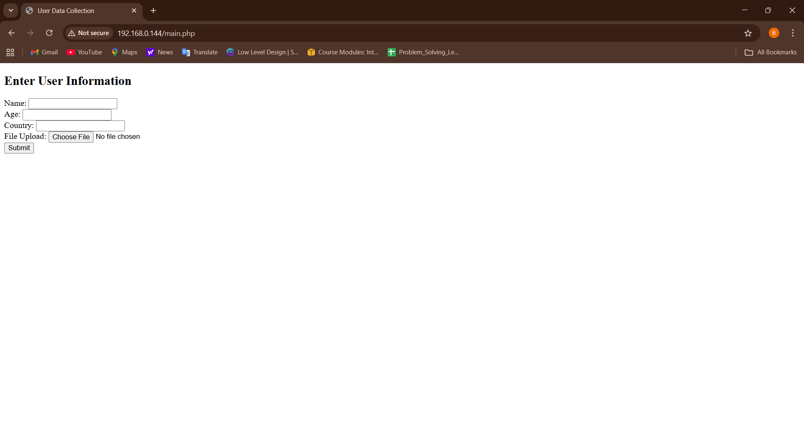
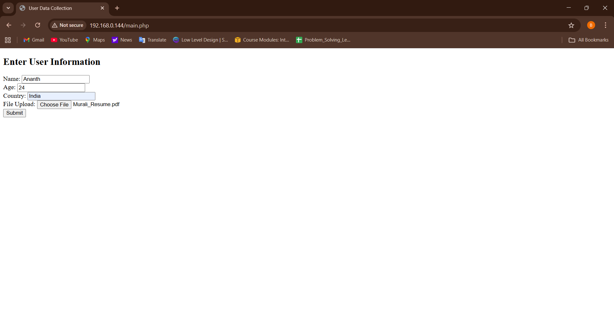
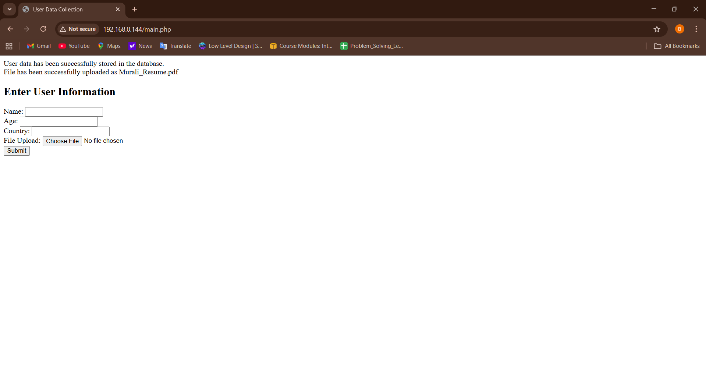
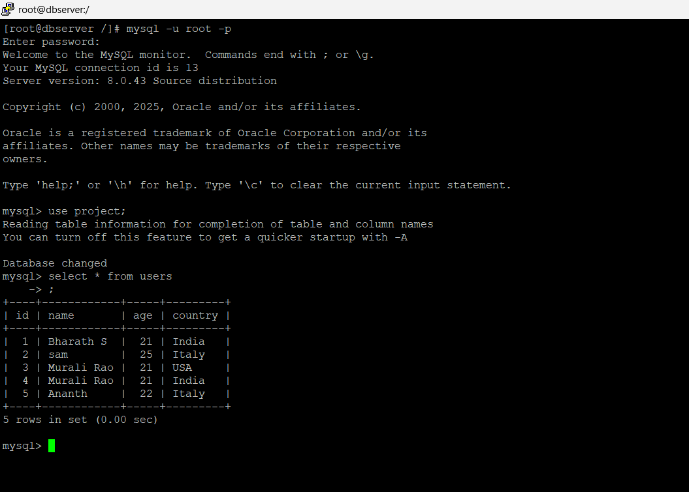
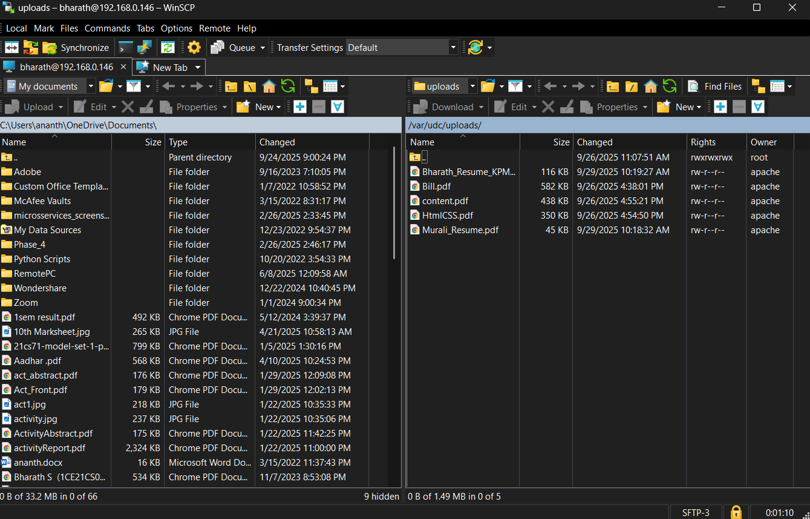

# User Data Collector (UDC)

This project is a **PHP & MySQL-based application** deployed on an **Apache Web Server** with a backend **MySQL Database Server**.  
It demonstrates end-to-end setup of a LAMP environment, database configuration, and a simple **User Data Collection** web application that supports storing user details and file uploads.

---

## 🚀 Features
- Apache Web Server setup with PHP 8.1
- MySQL Database installation & configuration
- Secure database connection (mysqli with prepared statements)
- User form to collect:
  - Name
  - Age
  - Country
- File upload support with validation
- Test pages to verify PHP and DB connectivity

---

## 🖼️ Screenshots

### PHP Home Page

### Writing Inputs

### File Upload Success

### Database Table

### Storing Path

